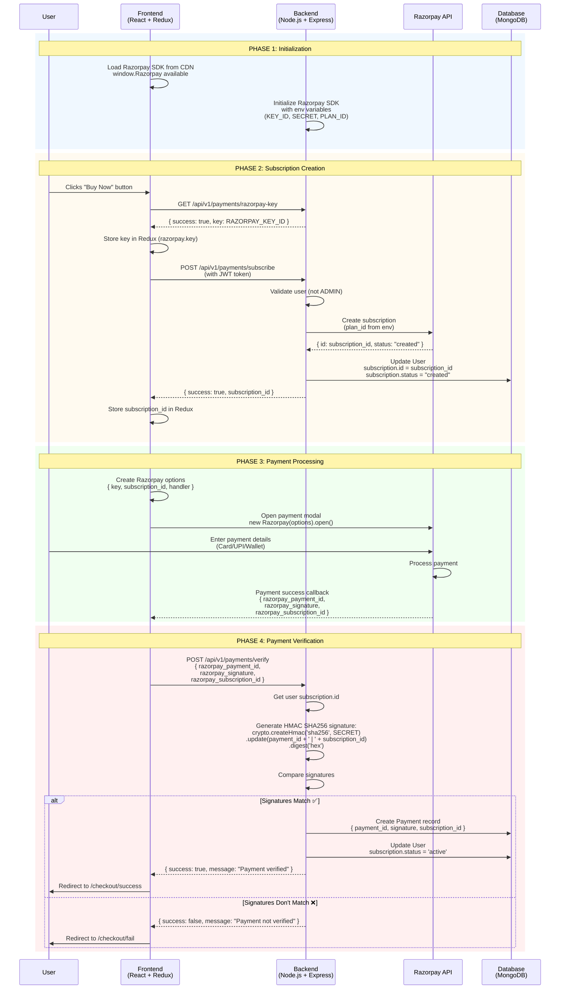
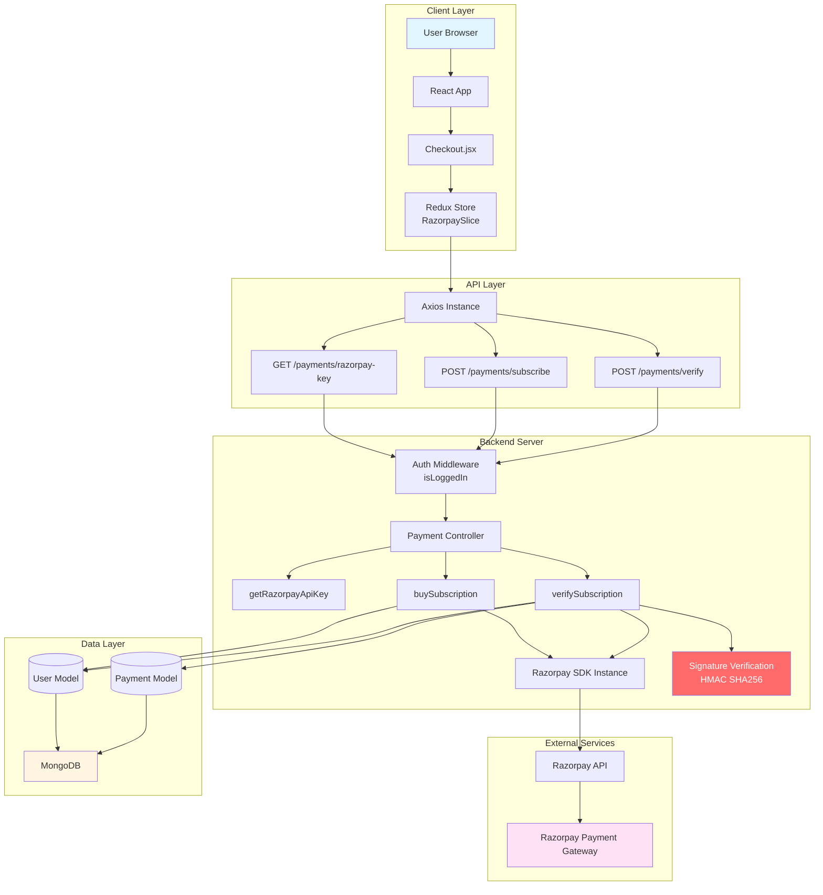
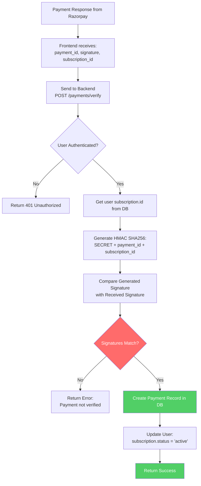

# Razorpay Payment Flow - Visual Diagrams

This document contains visual representations of the Razorpay payment integration flow.

---

## 🎯 Complete Payment Flow - Sequence Diagram



---

## 🏗️ Architecture Overview Diagram



---

## 📋 Step-by-Step Flow (Detailed)

### **Visual Representation**

```
┌─────────────────────────────────────────────────────────────────────────────┐
│                          RAZORPAY INTEGRATION FLOW                           │
└─────────────────────────────────────────────────────────────────────────────┘

┌─────────────────────────────────────────────────────────────────────────────┐
│ PHASE 1: SETUP & INITIALIZATION                                              │
└─────────────────────────────────────────────────────────────────────────────┘

┌─────────────┐                    ┌─────────────┐
│  Frontend   │                    │   Backend   │
│  (Browser)  │                    │  (Server)   │
└──────┬──────┘                    └──────┬──────┘
       │                                   │
       │ 1. Load Razorpay CDN              │ 2. Initialize Razorpay SDK
       │    <script src=                   │    new Razorpay({
       │      "checkout.razorpay.com">     │      key_id: env.KEY_ID,
       │                                   │      key_secret: env.SECRET
       │                                   │    })
       │                                   │
       └───────────────────────────────────┘


┌─────────────────────────────────────────────────────────────────────────────┐
│ PHASE 2: USER INITIATES SUBSCRIPTION                                         │
└─────────────────────────────────────────────────────────────────────────────┘

┌─────────┐    ┌──────────┐    ┌─────────┐    ┌──────────┐    ┌──────────┐
│  User   │    │Frontend  │    │ Backend │    │ Razorpay │    │Database  │
└────┬────┘    └────┬─────┘    └────┬────┘    └────┬─────┘    └────┬─────┘
     │               │               │               │               │
     │ Click "Buy"   │               │               │               │
     ├──────────────>│               │               │               │
     │               │               │               │               │
     │               │ GET /razorpay-key            │               │
     │               ├──────────────────────────────>│               │
     │               │                               │               │
     │               │ Returns: { key: "rzp_xxx" }   │               │
     │               │<──────────────────────────────┤               │
     │               │                               │               │
     │               │ Store in Redux                │               │
     │               │                               │               │
     │               │ POST /subscribe               │               │
     │               ├──────────────────────────────>│               │
     │               │                               │               │
     │               │                               │ Create Subscription
     │               │                               ├──────────────>│
     │               │                               │               │
     │               │                               │ Returns:      │
     │               │                               │ subscription_id
     │               │                               │<──────────────┤
     │               │                               │               │
     │               │                               │ Save to User  │
     │               │                               ├───────────────>│
     │               │                               │               │
     │               │ Returns: { subscription_id }  │               │
     │               │<──────────────────────────────┤               │
     │               │                               │               │
     │               │ Store subscription_id         │               │
     │               │                               │               │


┌─────────────────────────────────────────────────────────────────────────────┐
│ PHASE 3: PAYMENT PROCESSING                                                  │
└─────────────────────────────────────────────────────────────────────────────┘

┌─────────┐    ┌──────────┐                        ┌──────────────────────┐
│  User   │    │Frontend  │                        │  Razorpay Gateway   │
└────┬────┘    └────┬─────┘                        └──────┬───────────────┘
     │               │                                    │
     │               │ Create Razorpay Options:          │
     │               │ {                                 │
     │               │   key: razorpayKey,               │
     │               │   subscription_id: sub_id,         │
     │               │   handler: callback               │
     │               │ }                                 │
     │               │                                    │
     │               │ Open Modal                         │
     │               ├───────────────────────────────────>│
     │               │                                    │
     │  Enter Payment Details (Card/UPI)                   │
     ├───────────────────────────────────────────────────>│
     │               │                                    │
     │               │                                    │ Process Payment
     │               │                                    │
     │               │ Payment Success Callback:          │
     │               │ {                                  │
     │               │   razorpay_payment_id: "pay_xxx",  │
     │               │   razorpay_signature: "sig_xxx",   │
     │               │   razorpay_subscription_id: "..." │
     │               │ }                                  │
     │               │<───────────────────────────────────┤
     │               │                                    │


┌─────────────────────────────────────────────────────────────────────────────┐
│ PHASE 4: PAYMENT VERIFICATION (CRITICAL SECURITY STEP)                      │
└─────────────────────────────────────────────────────────────────────────────┘

┌──────────┐    ┌─────────┐    ┌──────────┐    ┌──────────┐
│Frontend  │    │ Backend │    │Database  │    │ Razorpay │
└────┬─────┘    └────┬────┘    └────┬─────┘    └────┬─────┘
     │               │               │               │
     │ POST /verify  │               │               │
     │ {             │               │               │
     │   payment_id, │               │               │
     │   signature,  │               │               │
     │   sub_id      │               │               │
     │ }             │               │               │
     ├──────────────>│               │               │
     │               │               │               │
     │               │ Get user subscription.id       │
     │               │                               │
     │               │ Generate Expected Signature:  │
     │               │ crypto.createHmac('sha256',   │
     │               │   SECRET)                      │
     │               │   .update(payment_id +        │
     │               │     ' | ' + subscription_id)  │
     │               │   .digest('hex')              │
     │               │                               │
     │               │ Compare Signatures            │
     │               │                               │
     │               │ ┌─────────────────────────┐   │
     │               │ │ Signatures Match?       │   │
     │               │ └─────────────────────────┘   │
     │               │        │                      │
     │               │    YES │ NO                   │
     │               │    │   └──> Reject & Return   │
     │               │    │        Error             │
     │               │    │                          │
     │               │    ▼                          │
     │               │ Create Payment Record         │
     │               ├──────────────────────────────>│
     │               │                               │
     │               │ Update User:                  │
     │               │ subscription.status = 'active' │
     │               ├──────────────────────────────>│
     │               │                               │
     │               │ Return Success                │
     │               │                               │
     │<──────────────┤                               │
     │               │                               │
     │ Redirect to Success Page                      │
     │                                               │
```

---

## 🔐 Security Verification Flow



---

## 📊 Data Flow Summary

```
ENVIRONMENT VARIABLES (Backend Only)
├── RAZORPAY_KEY_ID → Sent to frontend (public)
├── RAZORPAY_SECRET → NEVER sent to frontend (secret)
└── RAZORPAY_PLAN_ID → Used to create subscriptions

FRONTEND STATE (Redux)
├── razorpay.key → Public key from backend
├── razorpay.subscription_id → Subscription ID from backend
└── razorpay.isPaymentVerified → Verification status

BACKEND DATABASE
├── User Model
│   └── subscription: { id: String, status: String }
└── Payment Model
    ├── razorpay_payment_id: String
    ├── razorpay_subscription_id: String
    └── razorpay_signature: String

RAZORPAY RESPONSE (Payment Success)
├── razorpay_payment_id → Unique payment ID
├── razorpay_signature → HMAC signature for verification
└── razorpay_subscription_id → Subscription reference
```

---

## 🎯 Quick Reference - Flow Steps

```
1. [User] → Click "Buy Now"
2. [Frontend] → Get Razorpay public key
3. [Frontend] → Create subscription (get subscription_id)
4. [Frontend] → Open Razorpay payment modal
5. [User] → Complete payment
6. [Razorpay] → Return payment details + signature
7. [Frontend] → Send to backend for verification
8. [Backend] → Verify signature (HMAC SHA256)
9. [Backend] → Save payment record & activate subscription
10. [Frontend] → Redirect to success page
```

---

**Note:** All diagrams can be viewed in:
- GitHub (Mermaid diagrams render automatically)
- VS Code (with Mermaid extension)
- Markdown viewers that support Mermaid
- ASCII diagrams work everywhere


