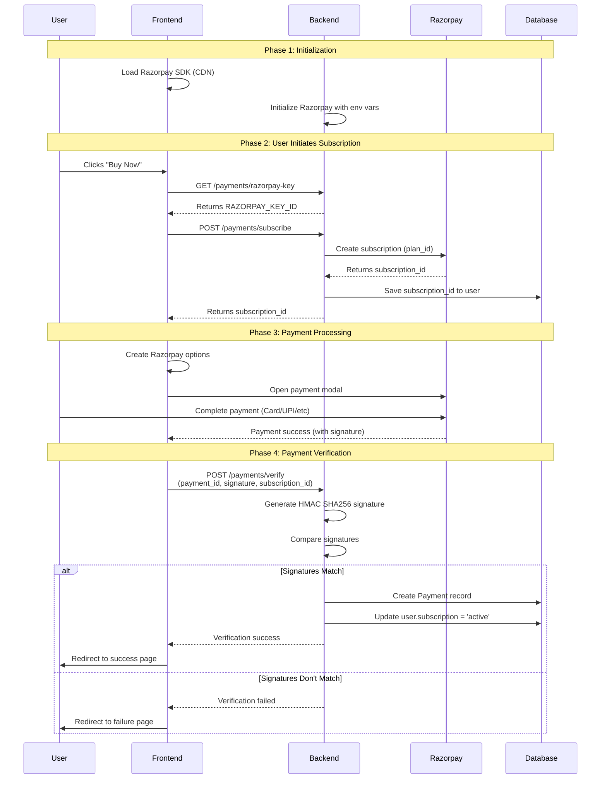
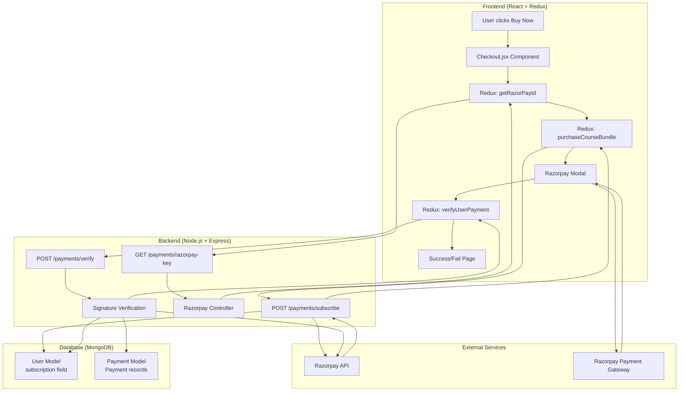

# Razorpay Payment Gateway Integration - Interview Explanation

## Overview
The application integrates Razorpay as a subscription-based payment gateway for purchasing course bundles. The integration follows Razorpay's subscription model where users can subscribe to access all courses for a 1-year period.

---

## Architecture Overview

### **Technology Stack:**
- **Backend:** Node.js with Express
- **Frontend:** React with Redux for state management
- **Payment Gateway:** Razorpay SDK (version 2.9.4)
- **Database:** MongoDB (Mongoose for ODM)

---

## Payment Flow Diagrams

### **Visual Flow Diagram (Mermaid)**



### **Architecture Flow Diagram**



### **ASCII Flow Diagram**

```
┌─────────────────────────────────────────────────────────────────────────┐
│                        RAZORPAY PAYMENT FLOW                             │
└─────────────────────────────────────────────────────────────────────────┘

PHASE 1: INITIALIZATION
═══════════════════════════════════════════════════════════════════════════

[Frontend]                    [Backend]                    [Razorpay]
    │                              │                              │
    │  Load Razorpay SDK (CDN)    │                              │
    │  ──────────────────────────> │                              │
    │                              │  Initialize SDK              │
    │                              │  (KEY_ID, SECRET, PLAN_ID)   │
    │                              │  ──────────────────────────> │
    │                              │                              │


PHASE 2: SUBSCRIPTION CREATION
═══════════════════════════════════════════════════════════════════════════

[User]              [Frontend]           [Backend]          [Database]      [Razorpay]
 │                    │                     │                   │                 │
 │  Click "Buy Now"   │                     │                   │                 │
 │ ──────────────────>│                     │                   │                 │
 │                    │                     │                   │                 │
 │                    │ GET /razorpay-key   │                   │                 │
 │                    │ ────────────────────> │                   │                 │
 │                    │                     │                   │                 │
 │                    │  Returns KEY_ID     │                   │                 │
 │                    │ <───────────────────│                   │                 │
 │                    │                     │                   │                 │
 │                    │ POST /subscribe     │                   │                 │
 │                    │ ───────────────────>│                   │                 │
 │                    │                     │  Create Subscription               │
 │                    │                     │ ──────────────────────────────────>│
 │                    │                     │                   │                 │
 │                    │                     │  Returns subscription_id           │
 │                    │                     │ <─────────────────────────────────────│
 │                    │                     │                   │                 │
 │                    │                     │  Save to User      │                 │
 │                    │                     │ ──────────────────>│                 │
 │                    │                     │                   │                 │
 │                    │  Returns subscription_id                │                 │
 │                    │ <───────────────────│                   │                 │


PHASE 3: PAYMENT PROCESSING
═══════════════════════════════════════════════════════════════════════════

[User]              [Frontend]                                [Razorpay Gateway]
 │                    │                                                 │
 │                    │  Open Razorpay Modal                            │
 │                    │  (key, subscription_id, handler)                 │
 │                    │ ──────────────────────────────────────────────>│
 │                    │                                                 │
 │  Enter Payment     │                                                 │
 │ ──────────────────>│                                                 │
 │                    │                                                 │
 │                    │  Process Payment                                │
 │                    │ <─────────────────────────────────────────────  │
 │                    │                                                 │
 │                    │  Payment Success Response:                      │
 │                    │  {payment_id, signature, subscription_id}       │
 │                    │ <─────────────────────────────────────────────  │


PHASE 4: PAYMENT VERIFICATION
═══════════════════════════════════════════════════════════════════════════

[Frontend]           [Backend]            [Database]          [Razorpay]
 │                     │                     │                   │
 │ POST /verify        │                     │                   │
 │ (payment_id,        │                     │                   │
 │  signature,         │                     │                   │
 │  subscription_id)   │                     │                   │
 │ ──────────────────> │                     │                   │
 │                     │                     │                   │
 │                     │  Generate HMAC      │                   │
 │                     │  SHA256 Signature   │                   │
 │                     │  (with SECRET)      │                   │
 │                     │                     │                   │
 │                     │  Compare Signatures │                   │
 │                     │                     │                   │
 │                     │  ┌─────────────┐   │                   │
 │                     │  │ Signatures  │   │                   │
 │                     │  │   Match?    │   │                   │
 │                     │  └─────────────┘   │                   │
 │                     │         │           │                   │
 │                     │    YES  │  NO       │                   │
 │                     │    │    └──> Reject │                   │
 │                     │    │                │                   │
 │                     │    ▼                │                   │
 │                     │  Create Payment ────>│                   │
 │                     │  Record              │                   │
 │                     │                     │                   │
 │                     │  Update User ───────>│                   │
 │                     │  subscription       │                   │
 │                     │  = 'active'        │                   │
 │                     │                     │                   │
 │  Success Response   │                     │                   │
 │ <────────────────── │                     │                   │
 │                     │                     │                   │
 │  Redirect to        │                     │                   │
 │  Success Page       │                     │                   │
```

---

## Complete Payment Flow (Step-by-Step)

### **Phase 1: Initialization & Setup**

1. **Backend Initialization (server/server.js)**
   - Razorpay SDK is imported and initialized with credentials from environment variables:
     - `RAZORPAY_KEY_ID` - Public key (sent to frontend)
     - `RAZORPAY_SECRET` - Secret key (used only on backend)
     - `RAZORPAY_PLAN_ID` - Pre-configured subscription plan ID in Razorpay dashboard
   - The Razorpay instance is exported to be used across controllers

2. **Frontend SDK Loading (client/index.html)**
   - Razorpay Checkout SDK is loaded via CDN: `<script src="https://checkout.razorpay.com/v1/checkout"></script>`
   - This makes `window.Razorpay` available globally in the frontend

---

### **Phase 2: User Initiates Subscription**

3. **User clicks "Buy Now" on Checkout Page (client/src/Pages/Payment/Checkout.jsx)**
   - Component loads and dispatches two Redux actions on mount:
     - `getRazorPayId()` - Fetches Razorpay public key
     - `purchaseCourseBundle()` - Creates subscription on backend

4. **Get Razorpay API Key (Frontend → Backend)**
   ```
   GET /payments/razorpay-key
   ```
   - **Controller:** `getRazorpayApiKey` in `payment.controller.js`
   - **Authentication:** Requires user to be logged in (`isLoggedIn` middleware)
   - **Response:** Returns `RAZORPAY_KEY_ID` (public key only, not secret)
   - **Frontend State:** Key is stored in Redux slice (`razorpay.key`)

5. **Create Subscription (Frontend → Backend)**
   ```
   POST /payments/subscribe
   ```
   - **Controller:** `buySubscription` in `payment.controller.js`
   - **Authentication:** Requires logged-in user
   - **Validation:**
     - User must exist
     - User role cannot be 'ADMIN' (admins cannot purchase subscriptions)
   - **Process:**
     - Creates a Razorpay subscription using `razorpay.subscriptions.create()` with the plan_id
     - Stores subscription ID and status in user's subscription field in database
     - Returns `subscription_id` to frontend
   - **Frontend State:** Subscription ID stored in Redux (`razorpay.subscription_id`)

---

### **Phase 3: Payment Gateway Interaction**

6. **Razorpay Checkout Opens (Frontend - client/src/Pages/Payment/Checkout.jsx)**
   - When user submits the form, `handleSubscription()` is called
   - Creates Razorpay payment object with configuration:
     ```javascript
     {
       key: razorpayKey,                    // Public key from step 4
       subscription_id: subscription_id,    // From step 5
       name: "Coursify Pvt. Ltd.",
       description: "Subscription",
       theme: { color: '#F37254' },
       prefill: {
         email: userData.email,
         name: userData.fullName
       },
       handler: async function (response) { ... }  // Success callback
     }
     ```
   - Opens Razorpay payment modal: `paymentObject.open()`
   - User completes payment through Razorpay's secure payment gateway

---

### **Phase 4: Payment Verification**

7. **Payment Success Handler (Frontend)**
   - After successful payment, Razorpay returns response containing:
     - `razorpay_payment_id`
     - `razorpay_signature`
     - `razorpay_subscription_id`
   - Frontend dispatches `verifyUserPayment()` action with these details

8. **Verify Payment on Backend**
   ```
   POST /payments/verify
   ```
   - **Controller:** `verifySubscription` in `payment.controller.js`
   - **Security - Signature Verification:**
     - **CRITICAL:** Backend generates HMAC SHA256 signature using:
       - Secret key: `RAZORPAY_SECRET`
       - Message: `${razorpay_payment_id} | ${subscriptionId}`
     - Compares generated signature with received signature
     - If signatures don't match → Payment is rejected (prevents fraud)
   - **Process:**
     - Validates user and subscription
     - Creates payment record in database (Payment model)
     - Updates user subscription status to 'active'
     - Returns success response
   - **Frontend:** Redirects to success/failure page based on verification result

---

### **Phase 5: Subscription Management**

9. **Cancel Subscription**
   ```
   POST /payments/unsubscribe
   ```
   - **Controller:** `cancelSubscription` in `payment.controller.js`
   - Cancels subscription via Razorpay API: `razorpay.subscriptions.cancel(subscriptionId)`
   - Updates user subscription status in database

10. **Admin - View All Payments**
    ```
    GET /payments?count=100
    ```
    - **Controller:** `allPayment` in `payment.controller.js`
    - **Authorization:** Only ADMIN role can access
    - Fetches all subscriptions from Razorpay

---

## Key Security Features

1. **Signature Verification:**
   - All payments are verified server-side using HMAC SHA256
   - Prevents payment tampering/fraud
   - Secret key never exposed to frontend

2. **Authentication & Authorization:**
   - All payment endpoints require user authentication
   - Admin-specific endpoints have role-based access control
   - Admins cannot purchase subscriptions

3. **Environment Variables:**
   - Sensitive credentials stored in environment variables
   - Secret key never sent to frontend (only public key)

---

## Database Schema

### **User Model (subscription field):**
```javascript
subscription: {
  id: String,      // Razorpay subscription ID
  status: String   // e.g., "active", "cancelled", "pending"
}
```

### **Payment Model:**
```javascript
{
  razorpay_payment_id: String,        // Unique payment ID
  razorpay_subscription_id: String,   // Subscription ID
  razorpay_signature: String,         // Verification signature
  timestamps: true                    // createdAt, updatedAt
}
```

---

## Redux State Management

**Razorpay Slice (`client/src/Redux/Slices/RazorpaySlice.js`):**
- `key`: Razorpay public key
- `subscription_id`: Current subscription ID
- `isPaymentVerified`: Payment verification status
- `allPayments`: All payment records (admin)
- `monthlySalesRecord`: Sales analytics (admin)

---

## API Endpoints Summary

| Endpoint | Method | Auth | Purpose |
|----------|--------|------|---------|
| `/payments/razorpay-key` | GET | Required | Get Razorpay public key |
| `/payments/subscribe` | POST | Required | Create subscription |
| `/payments/verify` | POST | Required | Verify payment signature |
| `/payments/unsubscribe` | POST | Required | Cancel subscription |
| `/payments` | GET | Admin Only | Get all payment records |

---

## Interview Answer Template

**"How did you integrate Razorpay?"**

"I integrated Razorpay as a subscription-based payment gateway for our Learning Management System. Here's the flow:

**1. Setup:** I initialized the Razorpay SDK on the backend using environment variables for the key ID, secret, and a pre-configured subscription plan ID. On the frontend, I loaded Razorpay's Checkout SDK via CDN.

**2. Subscription Creation:** When a user wants to subscribe, the frontend first fetches the Razorpay public key from our backend API. Then, it calls another endpoint to create a Razorpay subscription on the backend, which returns a subscription ID that's stored in the user's profile.

**3. Payment Process:** The frontend opens Razorpay's payment modal with the subscription ID. Users complete payment through Razorpay's secure gateway, which handles all payment methods.

**4. Verification (Critical Security Step):** After payment, Razorpay returns payment details including a signature. The frontend sends this to our backend, where I verify the payment using HMAC SHA256 signature verification with our secret key. This prevents fraud and ensures the payment is legitimate. Only after successful verification do we mark the subscription as active and store the payment record.

**5. Security:** I implemented proper security by keeping the secret key only on the backend, requiring authentication for all endpoints, and verifying every payment server-side before marking it as successful.

The integration uses Razorpay's subscription model, which is ideal for recurring course access, and I've also implemented features for subscription cancellation and admin payment analytics."

---

## Technical Highlights to Mention

✅ **Subscription-based model** (not one-time payments)
✅ **Server-side signature verification** (security best practice)
✅ **Environment variable configuration** (secure credential management)
✅ **Redux state management** (centralized payment state)
✅ **Error handling** (comprehensive try-catch and validation)
✅ **Role-based access control** (admin vs user permissions)
✅ **Payment record tracking** (database persistence for audit trail)

